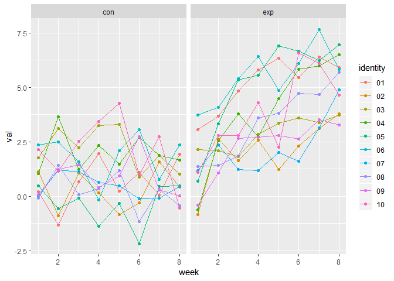

Hw\_5
================
Jyoti Ankam
November 6, 2018

``` r
library(tidyverse)
```

    ## -- Attaching packages ------------------------------------------------ tidyverse 1.2.1 --

    ## v ggplot2 3.1.0     v purrr   0.2.5
    ## v tibble  1.4.2     v dplyr   0.7.7
    ## v tidyr   0.8.2     v stringr 1.3.1
    ## v readr   1.1.1     v forcats 0.3.0

    ## -- Conflicts --------------------------------------------------- tidyverse_conflicts() --
    ## x dplyr::filter() masks stats::filter()
    ## x dplyr::lag()    masks stats::lag()

``` r
library(plotly)
```

    ## 
    ## Attaching package: 'plotly'

    ## The following object is masked from 'package:ggplot2':
    ## 
    ##     last_plot

    ## The following object is masked from 'package:stats':
    ## 
    ##     filter

    ## The following object is masked from 'package:graphics':
    ## 
    ##     layout

Problem 1

Loading the dataset into R and extracting the paths of the files to name then into lists

``` r
plyr::ldply(.data = "./data/hw5_data.zip", .fun = unzip)
```

    ##                  V1                           V2                V3
    ## 1 ./data/exp_05.csv ./__MACOSX/data/._exp_05.csv ./data/exp_04.csv
    ##                             V4                V5
    ## 1 ./__MACOSX/data/._exp_04.csv ./data/exp_10.csv
    ##                             V6                V7
    ## 1 ./__MACOSX/data/._exp_10.csv ./data/exp_06.csv
    ##                             V8                V9
    ## 1 ./__MACOSX/data/._exp_06.csv ./data/exp_07.csv
    ##                            V10               V11
    ## 1 ./__MACOSX/data/._exp_07.csv ./data/exp_03.csv
    ##                            V12               V13
    ## 1 ./__MACOSX/data/._exp_03.csv ./data/exp_02.csv
    ##                            V14               V15
    ## 1 ./__MACOSX/data/._exp_02.csv ./data/exp_01.csv
    ##                            V16               V17
    ## 1 ./__MACOSX/data/._exp_01.csv ./data/con_06.csv
    ##                            V18               V19
    ## 1 ./__MACOSX/data/._con_06.csv ./data/con_07.csv
    ##                            V20               V21
    ## 1 ./__MACOSX/data/._con_07.csv ./data/con_05.csv
    ##                            V22               V23
    ## 1 ./__MACOSX/data/._con_05.csv ./data/con_10.csv
    ##                            V24               V25
    ## 1 ./__MACOSX/data/._con_10.csv ./data/con_04.csv
    ##                            V26               V27
    ## 1 ./__MACOSX/data/._con_04.csv ./data/con_01.csv
    ##                            V28               V29
    ## 1 ./__MACOSX/data/._con_01.csv ./data/con_03.csv
    ##                            V30               V31
    ## 1 ./__MACOSX/data/._con_03.csv ./data/con_02.csv
    ##                            V32               V33
    ## 1 ./__MACOSX/data/._con_02.csv ./data/con_09.csv
    ##                            V34               V35
    ## 1 ./__MACOSX/data/._con_09.csv ./data/con_08.csv
    ##                            V36               V37
    ## 1 ./__MACOSX/data/._con_08.csv ./data/exp_09.csv
    ##                            V38               V39
    ## 1 ./__MACOSX/data/._exp_09.csv ./data/exp_08.csv
    ##                            V40               V41
    ## 1 ./__MACOSX/data/._exp_08.csv ./__MACOSX/._data

``` r
path_files = list.files("./data", pattern = ".csv", full.names = TRUE)

names_files = basename(path_files)
```

Using a function to read the data

``` r
fn_read = function(data, tag_name){
  list(read_csv(file = data) %>% mutate(identity = tag_name))
}
```

In order to read all the csv files, we will iterate using the `map`function

``` r
read_all = purrr::map2(path_files, names_files, fn_read)
```

    ## Parsed with column specification:
    ## cols(
    ##   week_1 = col_double(),
    ##   week_2 = col_double(),
    ##   week_3 = col_double(),
    ##   week_4 = col_double(),
    ##   week_5 = col_double(),
    ##   week_6 = col_double(),
    ##   week_7 = col_double(),
    ##   week_8 = col_double()
    ## )
    ## Parsed with column specification:
    ## cols(
    ##   week_1 = col_double(),
    ##   week_2 = col_double(),
    ##   week_3 = col_double(),
    ##   week_4 = col_double(),
    ##   week_5 = col_double(),
    ##   week_6 = col_double(),
    ##   week_7 = col_double(),
    ##   week_8 = col_double()
    ## )
    ## Parsed with column specification:
    ## cols(
    ##   week_1 = col_double(),
    ##   week_2 = col_double(),
    ##   week_3 = col_double(),
    ##   week_4 = col_double(),
    ##   week_5 = col_double(),
    ##   week_6 = col_double(),
    ##   week_7 = col_double(),
    ##   week_8 = col_double()
    ## )
    ## Parsed with column specification:
    ## cols(
    ##   week_1 = col_double(),
    ##   week_2 = col_double(),
    ##   week_3 = col_double(),
    ##   week_4 = col_double(),
    ##   week_5 = col_double(),
    ##   week_6 = col_double(),
    ##   week_7 = col_double(),
    ##   week_8 = col_double()
    ## )
    ## Parsed with column specification:
    ## cols(
    ##   week_1 = col_double(),
    ##   week_2 = col_double(),
    ##   week_3 = col_double(),
    ##   week_4 = col_double(),
    ##   week_5 = col_double(),
    ##   week_6 = col_double(),
    ##   week_7 = col_double(),
    ##   week_8 = col_double()
    ## )
    ## Parsed with column specification:
    ## cols(
    ##   week_1 = col_double(),
    ##   week_2 = col_double(),
    ##   week_3 = col_double(),
    ##   week_4 = col_double(),
    ##   week_5 = col_double(),
    ##   week_6 = col_double(),
    ##   week_7 = col_double(),
    ##   week_8 = col_double()
    ## )
    ## Parsed with column specification:
    ## cols(
    ##   week_1 = col_double(),
    ##   week_2 = col_double(),
    ##   week_3 = col_double(),
    ##   week_4 = col_double(),
    ##   week_5 = col_double(),
    ##   week_6 = col_double(),
    ##   week_7 = col_double(),
    ##   week_8 = col_double()
    ## )
    ## Parsed with column specification:
    ## cols(
    ##   week_1 = col_double(),
    ##   week_2 = col_double(),
    ##   week_3 = col_double(),
    ##   week_4 = col_double(),
    ##   week_5 = col_double(),
    ##   week_6 = col_double(),
    ##   week_7 = col_double(),
    ##   week_8 = col_double()
    ## )
    ## Parsed with column specification:
    ## cols(
    ##   week_1 = col_double(),
    ##   week_2 = col_double(),
    ##   week_3 = col_double(),
    ##   week_4 = col_double(),
    ##   week_5 = col_double(),
    ##   week_6 = col_double(),
    ##   week_7 = col_double(),
    ##   week_8 = col_double()
    ## )
    ## Parsed with column specification:
    ## cols(
    ##   week_1 = col_double(),
    ##   week_2 = col_double(),
    ##   week_3 = col_double(),
    ##   week_4 = col_double(),
    ##   week_5 = col_double(),
    ##   week_6 = col_double(),
    ##   week_7 = col_double(),
    ##   week_8 = col_double()
    ## )
    ## Parsed with column specification:
    ## cols(
    ##   week_1 = col_double(),
    ##   week_2 = col_double(),
    ##   week_3 = col_double(),
    ##   week_4 = col_double(),
    ##   week_5 = col_double(),
    ##   week_6 = col_double(),
    ##   week_7 = col_double(),
    ##   week_8 = col_double()
    ## )
    ## Parsed with column specification:
    ## cols(
    ##   week_1 = col_double(),
    ##   week_2 = col_double(),
    ##   week_3 = col_double(),
    ##   week_4 = col_double(),
    ##   week_5 = col_double(),
    ##   week_6 = col_double(),
    ##   week_7 = col_double(),
    ##   week_8 = col_double()
    ## )
    ## Parsed with column specification:
    ## cols(
    ##   week_1 = col_double(),
    ##   week_2 = col_double(),
    ##   week_3 = col_double(),
    ##   week_4 = col_double(),
    ##   week_5 = col_double(),
    ##   week_6 = col_double(),
    ##   week_7 = col_double(),
    ##   week_8 = col_double()
    ## )

    ## Parsed with column specification:
    ## cols(
    ##   week_1 = col_double(),
    ##   week_2 = col_double(),
    ##   week_3 = col_double(),
    ##   week_4 = col_double(),
    ##   week_5 = col_double(),
    ##   week_6 = col_double(),
    ##   week_7 = col_integer(),
    ##   week_8 = col_double()
    ## )

    ## Parsed with column specification:
    ## cols(
    ##   week_1 = col_double(),
    ##   week_2 = col_double(),
    ##   week_3 = col_double(),
    ##   week_4 = col_double(),
    ##   week_5 = col_double(),
    ##   week_6 = col_double(),
    ##   week_7 = col_double(),
    ##   week_8 = col_double()
    ## )
    ## Parsed with column specification:
    ## cols(
    ##   week_1 = col_double(),
    ##   week_2 = col_double(),
    ##   week_3 = col_double(),
    ##   week_4 = col_double(),
    ##   week_5 = col_double(),
    ##   week_6 = col_double(),
    ##   week_7 = col_double(),
    ##   week_8 = col_double()
    ## )
    ## Parsed with column specification:
    ## cols(
    ##   week_1 = col_double(),
    ##   week_2 = col_double(),
    ##   week_3 = col_double(),
    ##   week_4 = col_double(),
    ##   week_5 = col_double(),
    ##   week_6 = col_double(),
    ##   week_7 = col_double(),
    ##   week_8 = col_double()
    ## )
    ## Parsed with column specification:
    ## cols(
    ##   week_1 = col_double(),
    ##   week_2 = col_double(),
    ##   week_3 = col_double(),
    ##   week_4 = col_double(),
    ##   week_5 = col_double(),
    ##   week_6 = col_double(),
    ##   week_7 = col_double(),
    ##   week_8 = col_double()
    ## )
    ## Parsed with column specification:
    ## cols(
    ##   week_1 = col_double(),
    ##   week_2 = col_double(),
    ##   week_3 = col_double(),
    ##   week_4 = col_double(),
    ##   week_5 = col_double(),
    ##   week_6 = col_double(),
    ##   week_7 = col_double(),
    ##   week_8 = col_double()
    ## )
    ## Parsed with column specification:
    ## cols(
    ##   week_1 = col_double(),
    ##   week_2 = col_double(),
    ##   week_3 = col_double(),
    ##   week_4 = col_double(),
    ##   week_5 = col_double(),
    ##   week_6 = col_double(),
    ##   week_7 = col_double(),
    ##   week_8 = col_double()
    ## )

    ## Parsed with column specification:
    ## cols(
    ##   uid = col_character(),
    ##   reported_date = col_integer(),
    ##   victim_last = col_character(),
    ##   victim_first = col_character(),
    ##   victim_race = col_character(),
    ##   victim_age = col_character(),
    ##   victim_sex = col_character(),
    ##   city = col_character(),
    ##   state = col_character(),
    ##   lat = col_double(),
    ##   lon = col_double(),
    ##   disposition = col_character()
    ## )

Binding all the files together

``` r
bind_all = purrr::map_df(read_all, bind_rows)

data_tidy = bind_all %>% 
  gather(key = week, value = val, week_1:week_8) %>% 
  mutate(identity = str_replace(identity, ".csv",""),
         week = as.numeric(str_replace(week, "week_", ""))) %>%
  separate(identity, into = c("group", "identity"), sep = "_") %>%
  mutate(identity = as.factor(identity))
```

    ## Warning: Expected 2 pieces. Missing pieces filled with `NA` in 417432 rows
    ## [21, 22, 23, 24, 25, 26, 27, 28, 29, 30, 31, 32, 33, 34, 35, 36, 37, 38,
    ## 39, 40, ...].

``` r
ggplot(data_tidy, aes(x = week, y = val, color = identity, group = identity)) + geom_point() + geom_line() + facet_grid(~group) 
```

    ## Warning: Removed 417432 rows containing missing values (geom_point).

    ## Warning: Removed 417432 rows containing missing values (geom_path).



Problem 2

Reading the dataset into R

``` r
homicide_df = read_csv("data/homicide-data.csv", col_names = TRUE) %>% 
  mutate(city_with_state = str_c(city, ",", " ", state))
```

    ## Parsed with column specification:
    ## cols(
    ##   uid = col_character(),
    ##   reported_date = col_integer(),
    ##   victim_last = col_character(),
    ##   victim_first = col_character(),
    ##   victim_race = col_character(),
    ##   victim_age = col_character(),
    ##   victim_sex = col_character(),
    ##   city = col_character(),
    ##   state = col_character(),
    ##   lat = col_double(),
    ##   lon = col_double(),
    ##   disposition = col_character()
    ## )

``` r
summary_df = homicide_df %>% 
  mutate(disposition = fct_collapse(homicide_df$disposition, "No arrest" = c("Closed without arrest","Open/No arrest"))) %>% group_by(city_with_state) %>% 
  count(disposition) %>% 
  spread(key = disposition, value = n) %>% 
  janitor::clean_names() %>% 
  mutate(total = closed_by_arrest + no_arrest)
```
