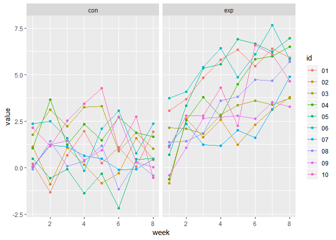

Homework 5
================
Jyoti Ankam
November 6, 2018

``` r
library(tidyverse)
library(plotly)
```

Problem 1

Loading the dataset into R and extracting the paths of the files to name them into lists

``` r
paths_df = tibble(path = list.files("./data/", pattern = "*.csv", full.names = TRUE),
                         name = basename(path))
```

Using a function to read the data

``` r
read_df = function(data){
  
  read_csv(file = data)
  
}
```

In order to read all the csv files, now iterating using the `map`function

``` r
fn_df = paths_df %>% mutate(data = purrr::map(paths_df$path, read_df)) %>% 
  unnest() %>% 
  select(-path) %>% 
  gather(key = week, value = value, week_1:week_8) %>% 
  mutate(id = str_replace(name, ".csv",""),
         week = as.numeric(str_replace(week, "week_", ""))) %>% 
  separate(id, into = c("group", "id"), sep = "_") %>% 
  mutate(id = as.factor(id))

ggplot(fn_df, aes(x = week, y = value, color = id, group = id)) + geom_point() + geom_line() + facet_grid(~group) +
  theme(legend.position = "right")
```



Problem 2

Reading the dataset into R

``` r
homicide_df = read_csv("data1/homicide-data.csv", col_names = TRUE) %>% 
  mutate(city_with_state = str_c(city, ",", " ", state))
```

Describing the dataset

This dataset collected by the Washington Post contains records on 52179 criminal homicides that occurred in 50 large American cities over the past decade. In total there are `52179` observations and `13` variables such as name, race, age and sex. There is also information on the demographics e.g. city, state, longitude and latitude. Variable named `disposition` records the status of the homicide i.e if it was open with no arrest, closed without any arrest or closed with arrest.

Obtaining the total number of homicides and the total number of unsolved cases

``` r
summary_df = homicide_df %>% 
  mutate(disposition = fct_collapse(homicide_df$disposition, "No arrest" = c("Closed without arrest","Open/No arrest"))) %>% group_by(city_with_state) %>% 
  count(disposition) %>% 
  spread(key = disposition, value = n) %>% 
  janitor::clean_names() %>% 
  mutate(total = closed_by_arrest + no_arrest)
```

Now we will use the function prop.test to estimate the total proportion of unsolved homicides in the city of Baltimore, MD

``` r
balt = summary_df %>% filter(city_with_state == "Baltimore, MD")
balt_prop = prop.test(balt$no_arrest, balt$total) %>% 
  broom::tidy() %>% 
  select(estimate, conf.low, conf.high) %>% 
  janitor::clean_names() %>% 
  knitr::kable()

balt_prop
```

|   estimate|  conf\_low|  conf\_high|
|----------:|----------:|-----------:|
|  0.6455607|  0.6275625|   0.6631599|

Running prop.test for each of the cities in the dataset, and extracting both the proportion of unsolved homicides and the confidence interval for each. Using a “tidy” pipeline, making use of purrr::map, purrr::map2, list columns and unnesting to create a tidy dataframe with estimated proportions and CIs for each city.

Writing a function to do prop.test

``` r
prop_df = function(data_table){
  
  try(prop.test(data_table$no_arrest, data_table$total) %>% 
    broom::tidy() %>% 
    select(estimate, conf.low, conf.high), silent = TRUE)
}
```

Iteration

``` r
unnested_df = summary_df %>% group_by(city_with_state) %>% nest() %>% 
  mutate(estimate_ci = map(data, prop_df)) %>% filter(city_with_state != "Tulsa, AL") %>% unnest() %>% 
  mutate(city_with_state = reorder(city_with_state, estimate)) %>% janitor::clean_names()
```

Creating a plot showing the estimates and CIs for each city

``` r
ggplot(unnested_df, aes(x = city_with_state, y = estimate )) + 
  geom_point() + geom_errorbar(aes(ymin = conf_low, ymax = conf_high)) + 
  theme(axis.text.x = element_text(angle = 70, hjust = 1, size = 8)) +
  labs(
    x = "City with State",
    y = "Proportion"
  )
```


